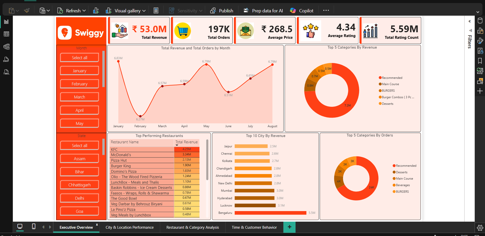

# Swiggy Sales and Customer Behavior Analysis (Capstone Project)
### 📌 Project Overview

This capstone project analyzes `197K Swiggy orders` across `4,437 categories`, `942 locations`, and `28 states`, uncovering key behavioral, operational, and revenue-driven insights.
The goal is to understand what, when, and why customers order, and to identify opportunities for business optimization, targeted promotions, and better category/restaurant strategy.

---

This project covers the full data workflow:
* Excel → Data validation and quick exploratory checks

* Python → Data cleaning, feature engineering, EDA

* SQL (PostgreSQL) → 50+ business queries (including CTEs & window functions)

* Power BI / Excel → 4-page interactive dashboard

* Business Insights & Recommendations based on real patterns

---

### 📂 Project Structure
```sql

Swiggy-Capstone/
│── data/                     → Raw & cleaned dataset
│── python/                   → Data cleaning, transformation, EDA
│── sql/                      → 50+ SQL business queries
│── dashboards/               → Power BI & Excel dashboards
│── ppt/                      → Final presentation
│── insights/                 → Business insights document
│── README.md                 → This documentation
```

### 📦 Dataset Summary
| Feature          | Count                            |
| ---------------- | -------------------------------- |
| Total Orders     | **197,430**                      |
| Total Revenue    | **₹53 Million**                  |
| Total Categories | **4,437**                        |
| Total Locations  | **942**                          |
| States Covered   | **28**                           |
| Top Restaurants  | 900+                             |
| Time Period      | Multi-month (transactional data) |

The dataset includes:
* `state`, `city`, `order_date`, `restaurant_name`, `location`, `category`, `dish_name`, `price`, `rating`, `rating_count`, `order_year`, `order_month`, `order_week`, `day_of_week`, `hour`, `weekend`

---

### ❓ Business Questions
This project answers several business-critical questions:

#### Customer & Demand Behavior
* What are the differences between weekday vs weekend demand?
* Which hours show peak orders and revenue?
* On which days do orders fluctuate the most?

#### Restaurant Performance
* Which restaurants generate the highest revenue & orders?
* What share do the top 10 restaurants hold?
* How do restaurant ratings influence orders?

#### Category & Pricing Insights
* Which categories generate the highest revenue?
* What is the demand share of low vs mid vs premium price items?
* How does price influence ratings?

#### Location Insights
* Which states and locations contribute most to revenue?
* Are there underperforming areas with growth potential?

---

### 🛠️ Technology Stack
##### 🔹 Python (Pandas, NumPy, Matplotlib)
Used for:

* Data cleaning
* Handling missing values
* Exploratory analysis
* Exporting clean dataset

##### 🔹 SQL (PostgreSQL)
Used for:
* Data extraction
* Aggregations (revenue, orders, restaurants, categories)
* Time-based & category-based analysis
* Creating analytical views for Power BI

##### 🔹 Power BI
Used for:
* Data modelling
* DAX calculations
* Creating 4-page interactive dashboard
* KPI-based storytelling

---


#### 📊 Dashboard
```sql
📌 Dashboard Page 1 – Sales & Order Overview

 
📌 Dashboard Page 2 – Restaurant Insights


📌 Dashboard Page 3 – Category & Pricing Analysis

 
📌 Dashboard Page 4 – Location & Customer Behavior  

```


#### 🔍 Final Insights
##### 📌 1. Weekday vs Weekend Performance

* Weekdays dominate with 71% of total orders (140K) and 70% of revenue (₹37.59M).

* Weekends contribute only 29% of orders (57K) and 30% of revenue (₹15.42M).

* Opportunity: Weekend-focused offers can significantly boost sales.

##### 📌 2. Top Restaurant Contribution

* Top 10 restaurants contribute ₹18M out of ₹57M (≈31%) revenue.

* They also contribute 63K orders out of 197K total.

* Supported by 4.0+ ratings and mid–premium pricing (₹200–₹400) → shows strong customer trust.

##### 📌 3. Category Performance

* Top categories (e.g., Recommended) generate ₹7.1M+ revenue.

* Low-performing categories like Beverages contribute minimal revenue.

* 3–5 categories drive ~17% of total platform revenue.

##### 📌 4. Price vs Rating Pattern

* Mid-price items (₹100–₹300) receive the highest ratings, proving customers value affordable quality.

* Some premium items also score high, showing customers accept higher prices when quality is justified.

##### 📌 5. Order Trend Insights

* Highest orders on Saturday & Sunday, but overall weekend contribution remains low → imbalance.

* Some days show high revenue but low orders, meaning higher-value purchases on those days.

* Orders fluctuate significantly between weekdays and weekends → need demand balancing.

#### 📬 Contact
```sql
👤 Maneesh Maurya
📫 Email: your-[mauryamaneesh1995@gmail.com]

🔗 LinkedIn: [https://linkedin.com/in/yourprofile]

💻 GitHub: [https://github.com/maneesh-maurya01]
```


### THE END 


